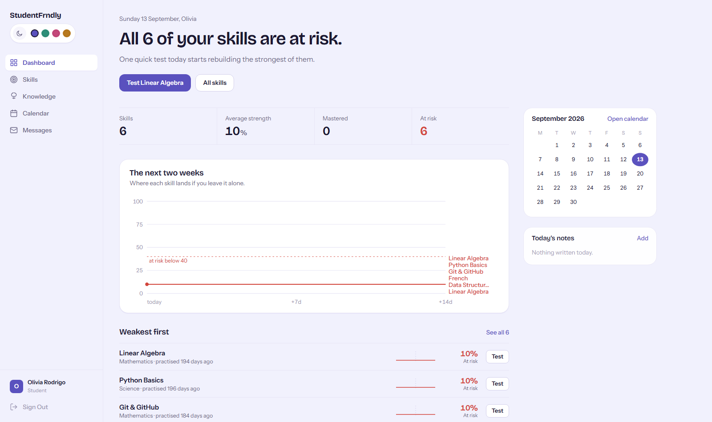
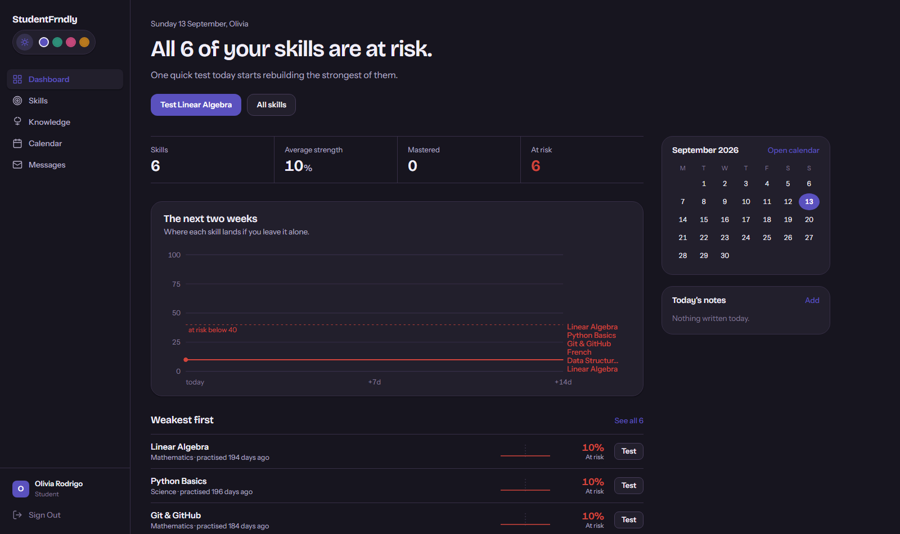
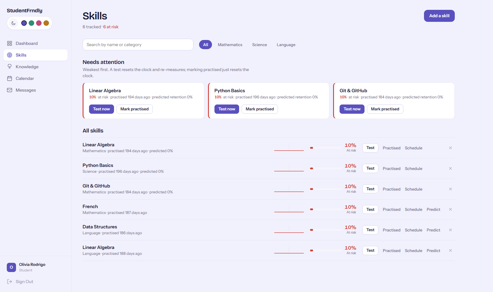
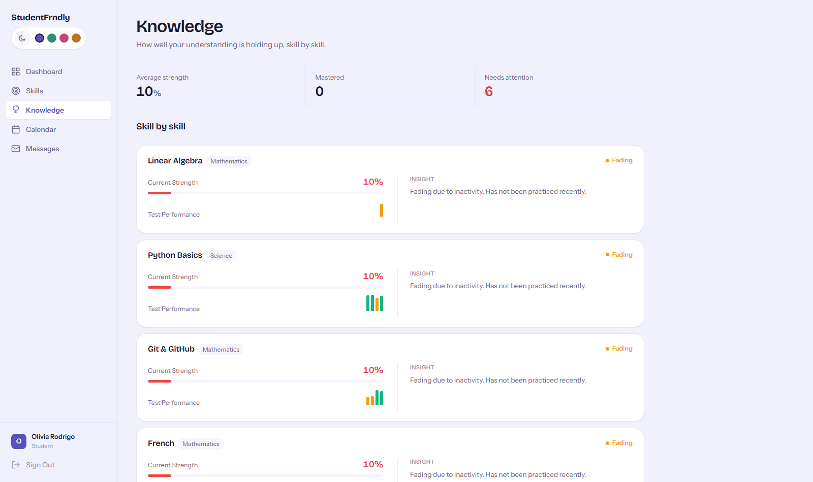
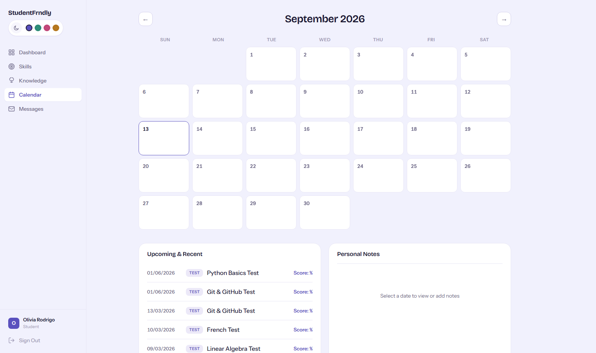

# StudentFrndly — Skill Decay & Knowledge Half-Life Tracker

Most learning apps track what you *studied*. This one tracks what you're *forgetting* — every skill decays on a half-life curve from the moment you stop practising it, and the app tells you exactly which one to touch today before it drops below "at risk."

<p align="center">
  
</p>

## What it actually does

- **Decay-aware skills, not a static list.** Every skill has a live strength score computed from days-since-practice on a configurable half-life curve, floored at 10% so nothing ever reads as fully "dead."
- **Tells you what to do next**, not just what happened — the dashboard leads with the single weakest skill and a one-click "Test now," not a wall of stats.
- **Quick tests** log accuracy over time and feed back into the retention model, so scoring well on a test measurably restores strength, not just resets a timer.
- **A 2-week forecast chart** — see where each skill lands if you leave it alone, before it happens.
- **Calendar-driven scheduling**, a knowledge-by-topic breakdown, student ↔ admin messaging, and an admin dashboard for reviewing company-account requests.
- **Auth**: email/password and Google OAuth, JWT-based, with role-gated routes (`student` / `admin`).
- **Dark mode + 4 accent palettes**, applied consistently across every page via CSS custom properties — not a filter, a second designed palette.

<p align="center">
  
</p>

## Screenshots

| Skills | Knowledge |
|---|---|
|  |  |

| Calendar |
|---|
|  |

## Architecture

- **Backend**: Node.js/Express, `better-sqlite3` for storage (file-backed, zero setup — no separate DB server to run), JWT auth, rate-limited auth routes, structured logging.
- **Frontend**: React 18 + Vite, `react-router-dom` v6, `framer-motion` for motion, plain per-component CSS on a shared design-token system (no CSS framework).
- **Design system**: one token file (`frontend/src/index.css`) drives every color, radius, and shadow across the app — including a fully separate dark-mode palette, not an inverted light one.

```
├── backend/
│   ├── src/
│   │   ├── storage/       # better-sqlite3 data-access layer
│   │   ├── services/      # business logic (auth, skills, decay math, calendar, admin)
│   │   ├── controllers/   # request handlers
│   │   ├── routes/        # API endpoints
│   │   └── middleware/    # auth, rate limiting, error handling
│   └── data/               # sqlite db files
├── frontend/
│   └── src/
│       ├── pages/          # Dashboard, Skills, Knowledge, Calendar, Messages, Admin, Login, Signup...
│       ├── components/     # Sidebar, DecayChart, ThemeToggle, VoxelPortrait, StudyScene...
│       ├── context/        # Auth, Theme, Motion
│       └── services/       # API client
└── docs/screenshots/        # images used in this README
```

## Getting started

### Prerequisites

- Node.js 18+
- npm

### Backend

```bash
cd backend
npm install
cp .env.example .env   # then fill in JWT_SECRET (and GOOGLE_CLIENT_ID if you want Google login)
npm run dev            # http://localhost:3000
```

### Frontend

```bash
cd frontend
npm install
npm run dev             # http://localhost:5173, proxies /api to :3000
```

### Try it with seed data

```bash
cd backend
node seed_db.js
```

Then log in with any of the seeded accounts (password `password123`), e.g. `olivia@test.com`.

## Skill decay model

```
currentStrength = max(10, initialProficiency - (initialProficiency × decayRate × daysSinceLastPractice))
```

- Decays daily from the last practice/test date, floored at **10%** — a skill is never shown as fully gone.
- Recomputed live on every read; nothing is a stale cached number.
- Bands: **Mastered** (≥70%), **Fading** (40–69%), **At risk** (<40%) — the same thresholds are used on both the backend and the frontend so a skill can't read differently on two pages.

## API surface (selected)

All routes below require `Authorization: Bearer <token>` unless noted.

| Method | Route | What it does |
|---|---|---|
| `POST` | `/api/auth/login` | Email/password login |
| `POST` | `/api/auth/google` | Google OAuth login |
| `POST` | `/api/skills` | Create a skill |
| `GET` | `/api/skills` | List skills with live decay applied |
| `PATCH` | `/api/skills/:id/practice` | Mark practiced — resets the decay timer |
| `POST` | `/api/quick-test/:skillId/generate` | Generate a quick test for a skill |
| `POST` | `/api/quick-test/submit` | Submit answers — score feeds back into retention |
| `GET` | `/api/calendar` | Scheduled practice events |
| `GET` | `/api/messages` | Student ↔ admin messages |
| `GET` | `/api/admin/analytics` | *(admin)* Aggregate stats across all students |
| `GET` | `/api/health` | Liveness check |

## Roadmap

- [ ] Per-skill spaced-repetition scheduling suggestions (beyond "practice today")
- [ ] Export a skill's history as CSV
- [ ] Extend the dark-mode/palette toggle and voxel-portrait treatment to the Signup page for full visual consistency
- [ ] Automated test coverage for the decay math and retention endpoints
